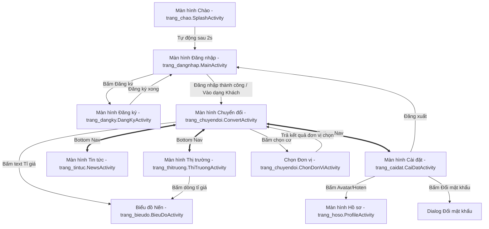
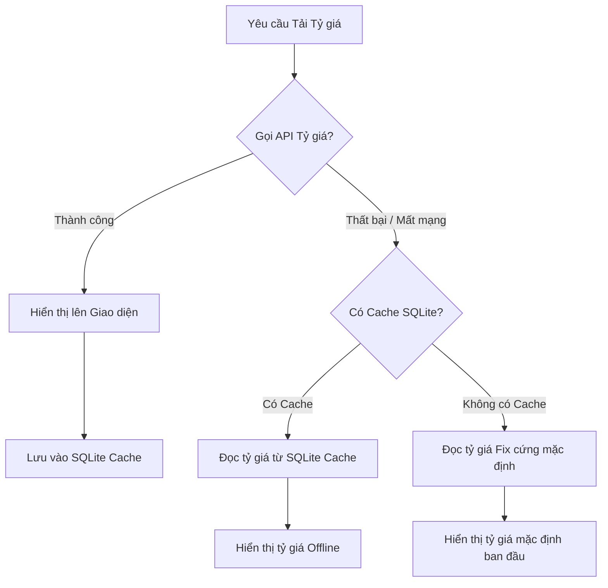

# 📱 Hướng Dẫn Sử Dụng & Tài Liệu Kỹ Thuật: Ứng Dụng Chuyển Đổi Tiền Tệ (BaiTapLonChuyenDoiTien)

Chào mừng bạn đến với tài liệu hướng dẫn chi tiết của dự án **BaiTapLonChuyenDoiTien**. Tài liệu này được biên soạn đầy đủ bằng tiếng Việt nhằm hỗ trợ người mới tiếp cận dễ dàng hiểu cấu trúc, kiến trúc hệ thống, và cách vận hành mã nguồn một cách cặn kẽ nhất.

---

## 🗺️ 1. Sơ đồ Kiến trúc & Luồng Hoạt động

### 🔄 1.1 Sơ đồ Điều hướng Màn hình (Navigation Flow)
Sơ đồ dưới đây mô tả cách các màn hình (Activity) liên kết và chuyển hướng qua lại lẫn nhau:

### ⚡ 1.2 Luồng Dữ liệu Tỷ giá và Chế độ Dự phòng (Offline Fallback Flow)
Khi người dùng yêu cầu xem tỉ giá quy đổi hoặc mở trang thị trường, ứng dụng sẽ thực hiện tải dữ liệu theo trình tự sau để đảm bảo hoạt động mượt mà ngay cả khi mất mạng:

---

## 📂 2. Cấu trúc Thư mục Dự án Java

Mã nguồn Java được chia thành **13 gói con (sub-packages)** bên dưới thư mục `app/src/main/java/com/example/baitaplon/` giúp phân vùng quản lý code theo từng trang và tính năng cụ thể. Mỗi thư mục con đều đi kèm tệp **README.md** giải thích chi tiết chức năng riêng biệt của thư mục đó:

1. 📂 **[trang_chao](file:///d:/Android/BaiTapLonChuyenDoiTien/app/src/main/java/com/example/baitaplon/trang_chao)**: Chứa màn hình chào mừng đầu tiên khi mở app.
   - `SplashActivity.java`
   - `README.md`
2. 📂 **[trang_dangnhap](file:///d:/Android/BaiTapLonChuyenDoiTien/app/src/main/java/com/example/baitaplon/trang_dangnhap)**: Quản lý giao diện và logic đăng nhập.
   - `MainActivity.java`
   - `README.md`
3. 📂 **[trang_dangky](file:///d:/Android/BaiTapLonChuyenDoiTien/app/src/main/java/com/example/baitaplon/trang_dangky)**: Quản lý giao diện và logic tạo tài khoản mới.
   - `DangKyActivity.java`
   - `README.md`
4. 📂 **[trang_chuyendoi](file:///d:/Android/BaiTapLonChuyenDoiTien/app/src/main/java/com/example/baitaplon/trang_chuyendoi)**: Quản lý quy đổi ngoại tệ chính.
   - `ConvertActivity.java`, `ChonDonViActivity.java`, `ThongTinCacQuocGiaADapter.java`
   - `README.md`
5. 📂 **[trang_thitruong](file:///d:/Android/BaiTapLonChuyenDoiTien/app/src/main/java/com/example/baitaplon/trang_thitruong)**: Bảng giá thị trường biến động so với USD.
   - `ThiTruongActivity.java`, `ExchangeRateAdapter.java`
   - `README.md`
6. 📂 **[trang_bieudo](file:///d:/Android/BaiTapLonChuyenDoiTien/app/src/main/java/com/example/baitaplon/trang_bieudo)**: Đồ thị nến biểu diễn lịch sử thay đổi tỷ giá.
   - `BieuDoActivity.java`
   - `README.md`
7. 📂 **[trang_tintuc](file:///d:/Android/BaiTapLonChuyenDoiTien/app/src/main/java/com/example/baitaplon/trang_tintuc)**: Đọc tin tức kinh tế vĩ mô quốc tế và trong nước.
   - `NewsActivity.java`, `NewsAdapter.java`
   - `README.md`
8. 📂 **[trang_caidat](file:///d:/Android/BaiTapLonChuyenDoiTien/app/src/main/java/com/example/baitaplon/trang_caidat)**: Thiết lập giao diện Sáng/Tối và các hộp thoại điều khoản.
   - `CaiDatActivity.java`, `AboutUsDialog.java`, `TermsDialog.java`
   - `README.md`
9. 📂 **[trang_hoso](file:///d:/Android/BaiTapLonChuyenDoiTien/app/src/main/java/com/example/baitaplon/trang_hoso)**: Quản lý thông tin hồ sơ cá nhân và xóa tài khoản.
   - `ProfileActivity.java`
   - `README.md`
10. 📂 **[dulieu](file:///d:/Android/BaiTapLonChuyenDoiTien/app/src/main/java/com/example/baitaplon/dulieu)**: Các lớp quản lý kết nối cơ sở dữ liệu SQLite cục bộ.
    - `DataBaseHelper_DangKy.java`, `ExchangeRateCacheHelper.java`
    - `README.md`
11. 📂 **[model](file:///d:/Android/BaiTapLonChuyenDoiTien/app/src/main/java/com/example/baitaplon/model)**: Các cấu trúc lớp dữ liệu (Models) dùng chung.
    - `ThongTinDangKy.java`, `ThongTinCacQuocGia.java`, `ExchangeRateItem.java`, `ExchangeRateResponse.java`, `NewsArticle.java`, `NewsApiResponse.java`
    - `README.md`
12. 📂 **[api](file:///d:/Android/BaiTapLonChuyenDoiTien/app/src/main/java/com/example/baitaplon/api)**: Giao thức kết nối HTTP mạng qua Retrofit.
    - `ApiClient_Price.java`, `ApiClient_News_en.java`, `ExchangeRateApi.java`, `NewsApiService.java`
    - `README.md`
13. 📂 **[tienich](file:///d:/Android/BaiTapLonChuyenDoiTien/app/src/main/java/com/example/baitaplon/tienich)**: Chứa các lớp chức năng phụ trợ như xử lý tệp CSV và cào tin từ báo điện tử.
    - `CsvUtils.java`, `NguonTinTuc.java`
    - `README.md`

---

## 🎨 3. Cấu trúc Thư mục Giao diện XML (Layouts)

Ứng dụng cấu hình cơ chế `sourceSets` trong tệp `app/build.gradle.kts` để phân chia **17 tệp XML layout** thành **9 thư mục con** cụ thể bên dưới đường dẫn `app/src/main/res/layouts/` giúp dễ dàng tra cứu và chỉnh sửa riêng biệt cho từng trang. Mỗi thư mục con đều đính kèm tệp **README.md** giải thích chi tiết:

1. 📂 **[trang_chao](file:///d:/Android/BaiTapLonChuyenDoiTien/app/src/main/res/layouts/trang_chao)**:
   - `layout/activity_splash.xml` (Màn hình chào mừng)
   - `README.md`
2. 📂 **[trang_dangnhap](file:///d:/Android/BaiTapLonChuyenDoiTien/app/src/main/res/layouts/trang_dangnhap)**:
   - `layout/activity_login.xml` (Giao diện đăng nhập)
   - `README.md`
3. 📂 **[trang_dangky](file:///d:/Android/BaiTapLonChuyenDoiTien/app/src/main/res/layouts/trang_dangky)**:
   - `layout/activity_dang_ky.xml` (Giao diện tạo tài khoản mới)
   - `README.md`
4. 📂 **[trang_chuyendoi](file:///d:/Android/BaiTapLonChuyenDoiTien/app/src/main/res/layouts/trang_chuyendoi)**:
   - `layout/activity_convert.xml` (Giao diện chuyển đổi và bàn phím ảo)
   - `layout/activity_chon_don_vi_tien_te.xml` (Danh sách chọn nước)
   - `layout/item_chon_don_vi_chuyen_doi.xml` (Dòng phần tử cờ và tên nước)
   - `README.md`
5. 📂 **[trang_thitruong](file:///d:/Android/BaiTapLonChuyenDoiTien/app/src/main/res/layouts/trang_thitruong)**:
   - `layout/activity_thi_truong.xml` (Giao diện bảng giá thị trường)
   - `layout/item_exchange_rate.xml` (Dòng tỷ giá ngoại tệ)
   - `README.md`
6. 📂 **[trang_bieudo](file:///d:/Android/BaiTapLonChuyenDoiTien/app/src/main/res/layouts/trang_bieudo)**:
   - `layout/activity_bieu_do.xml` (Giao diện đồ thị nến TradingView)
   - `README.md`
7. 📂 **[trang_tintuc](file:///d:/Android/BaiTapLonChuyenDoiTien/app/src/main/res/layouts/trang_tintuc)**:
   - `layout/activity_news.xml` (Giao diện xem tin vĩ mô)
   - `layout/item_news.xml` (Dòng hiển thị bài viết tin)
   - `README.md`
8. 📂 **[trang_caidat](file:///d:/Android/BaiTapLonChuyenDoiTien/app/src/main/res/layouts/trang_caidat)**:
   - `layout/activity_cai_dat.xml` (Giao diện cài đặt và theme sáng/tối)
   - `layout/dialog_about_us.xml` (Hộp thoại Về chúng tôi)
   - `layout/dialog_terms_conditions.xml` (Hộp thoại Điều khoản dịch vụ)
   - `layout/dialog_doimatkhau.xml` (Hộp thoại đổi mật khẩu)
   - `README.md`
9. 📂 **[trang_hoso](file:///d:/Android/BaiTapLonChuyenDoiTien/app/src/main/res/layouts/trang_hoso)**:
   - `layout/activity_profile.xml` (Giao diện hồ sơ cá nhân)
   - `layout/dialog_suahoso.xml` (Hộp thoại chỉnh sửa thông tin)
   - `README.md`

---

## 💾 4. Cơ sở Dữ liệu SQLite

Ứng dụng quản lý dữ liệu thông qua **2 file cơ sở dữ liệu SQLite** độc lập:

### 👤 4.1 Cơ sở dữ liệu tài khoản (`dangky.db`)
Được định nghĩa trong lớp `DataBaseHelper_DangKy.java`, bảng dữ liệu là `tblDangKy`:

| Cột | Kiểu dữ liệu | Mô tả |
|---|---|---|
| `Id` | TEXT (Primary Key) | Mã người dùng dùng để đăng nhập |
| `name` | TEXT | Họ tên đầy đủ hiển thị trên ứng dụng |
| `password` | TEXT | Mật khẩu tài khoản |
| `email` | TEXT | Địa chỉ thư điện tử |
| `sdt` | TEXT | Số điện thoại di động |

### 📈 4.2 Cơ sở dữ liệu bộ nhớ đệm tỷ giá (`exchangerates.db`)
Được định nghĩa trong lớp `ExchangeRateCacheHelper.java`, bảng dữ liệu là `tblExchangeRates`:

| Cột | Kiểu dữ liệu | Mô tả |
|---|---|---|
| `base_currency` | TEXT (Primary Key tổ hợp) | Đồng tiền gốc làm chuẩn (thường là USD) |
| `target_currency` | TEXT (Primary Key tổ hợp) | Đồng tiền chuyển đổi đích (VND, JPY...) |
| `rate` | REAL | Tỉ giá quy đổi thực tế |

---

## 🌗 5. Thiết kế Chế độ Sáng / Tối (Light & Dark Theme)

Thiết kế chế độ sáng tối của ứng dụng sử dụng cơ chế tài nguyên động của hệ điều hành Android (Dynamic Theme Resources):
1. **Bảng màu:**
   - Chế độ Sáng định nghĩa các màu sắc nền trắng, chữ đen trong tệp `app/src/main/res/values/colors.xml` (`background_main` là `#F5F6FA`, `text_primary` là `#1E1E24`, `item_background` là `#FFFFFF`).
   - Chế độ Tối định nghĩa các màu nền xám tối, chữ trắng trong tệp `app/src/main/res/values-night/colors.xml` (`background_main` là `#121212`, `text_primary` là `#E5E7EB`, `item_background` là `#1F1F1F`).
2. **Mã XML Layout:** Tất cả các tệp XML layout (Đăng nhập, Đăng ký, Tin tức, Hồ sơ và toàn bộ các Dialog cài đặt/đổi mật khẩu) không sử dụng mã màu hex cứng (ví dụ: `#FFFFFF`), thay vào đó sử dụng biến tài nguyên như `@color/background_main`, `@color/item_background`, `@color/text_primary`, `@color/text_secondary` để tự động đổi màu khi theme thay đổi.
3. **Lưu ý đặc biệt cho bàn phím số giả lập:** Do các phím số sử dụng drawable nền gradient trắng-xám cố định (`custom_button1`) để giữ tính thẩm mỹ cao, màu chữ của các phím số này được đặt cố định là màu tối `#1E1E24` thay vì dùng màu động. Điều này giúp chữ số hiển thị rõ nét trên phím bấm trong cả chế độ Dark Mode.

---

## 🛠️ 6. Hướng dẫn Cài đặt & Chạy ứng dụng trên máy cá nhân

### Yêu cầu hệ thống:
- Android Studio phiên bản **Giraffe** hoặc mới hơn.
- JDK 17.
- Điện thoại giả lập Android (Emulator) hoặc điện thoại thật chạy Android 8.0 trở lên.

### Các bước thực hiện:
1. Mở **Android Studio**.
2. Chọn **File -> Open** và trỏ đến thư mục `BaiTapLonChuyenDoiTien`.
3. Đợi Android Studio đồng bộ hóa các thư viện qua tệp cấu hình **Gradle** (mất khoảng 1-3 phút tùy tốc độ mạng).
4. Nhấn nút **Run** (biểu tượng tam giác xanh) trên thanh công cụ để cài đặt ứng dụng lên thiết bị giả lập hoặc thiết bị thật của bạn.
5. Khởi chạy ứng dụng và trải nghiệm các tính năng!
